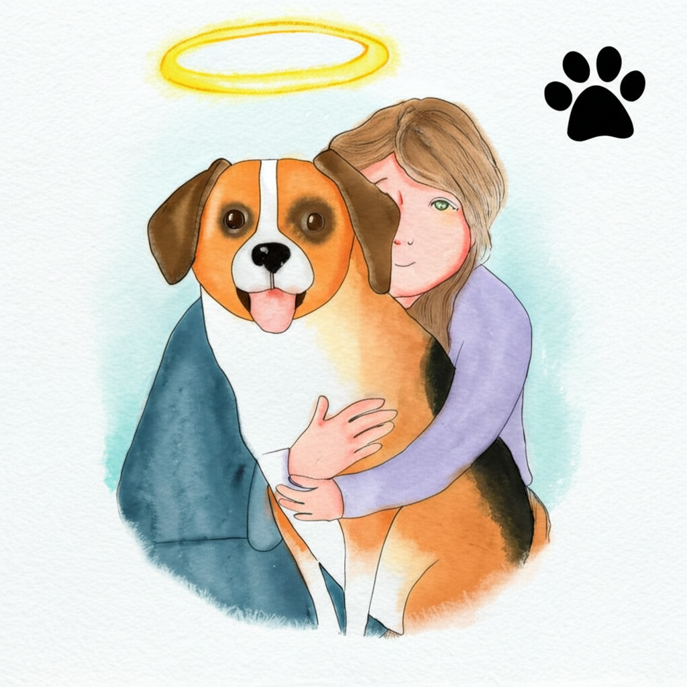

iCendant Empathy can analyze text input and generate empathetic output with text, images, and audio.

The output can either be an echo of the input using a different modality, an enhancement of the input using multiple modalities, an empathetic response to the input using multiple modalities.

Preview the API [Playground](https://icendant.com/empathy).

Review the API [design documentation](/api-reference/introduction)

Send email to <a href="mailto:support@icendant.com">support@icendant.com</a> if you would like to participate in our early access program.

### Examples

Below are examples of voice and image completions generated by iCendant Empathy.

<table>
<tr>
<td>Project Manager's Report</td>
<td>

</td>
</tr>
<tr>
<td>Friend's Response To Job loss</td>
<td>

<audio controls><source src="./assets/audio/job-loss.mp3" type="audio/mpeg" />Your browser does not support the audio element.</audio>
</td>
</tr>
<tr>
<td>Football Coach Response To Job Loss</td>
<td>

<audio controls><source src="./assets/audio/job-loss-coach-response.mp3" type="audio/mpeg" />Your browser does not support the audio element.</audio>
</td>
</tr>
<tr>
<td>Losing Pet</td>
<td>

<audio controls><source src="./assets/audio/losing-pet.mp3" type="audio/mpeg" />Your browser does not support the audio element.</audio>
</td>
</tr>
<tr>
<td>Dawn Poem</td>
<td>

<audio controls><source src="./assets/audio/dawn-poem.mp3" type="audio/mpeg" />Your browser does not support the audio element.</audio>
</td>
</tr>
<tr>
<td>Hope And Wonder Poem</td>
<td>

<audio controls><source src="./assets/audio/poem.mp3" type="audio/mpeg" />Your browser does not support the audio element.</audio>
</td>
</tr>
<tr>
<td>Loving kindness meditation</td>
<td>

<audio controls><source src="./assets/audio/loving-kindness-meditation.mp3" type="audio/mpeg" />Your browser does not support the audio element.</audio>
</td>
</tr>
<tr>
<td>Family meditation</td>
<td>

<audio controls><source src="./assets/audio/family-meditation-enhanced.mp3" type="audio/mpeg" />Your browser does not support the audio element.</audio>
</td>
</tr>
</table>