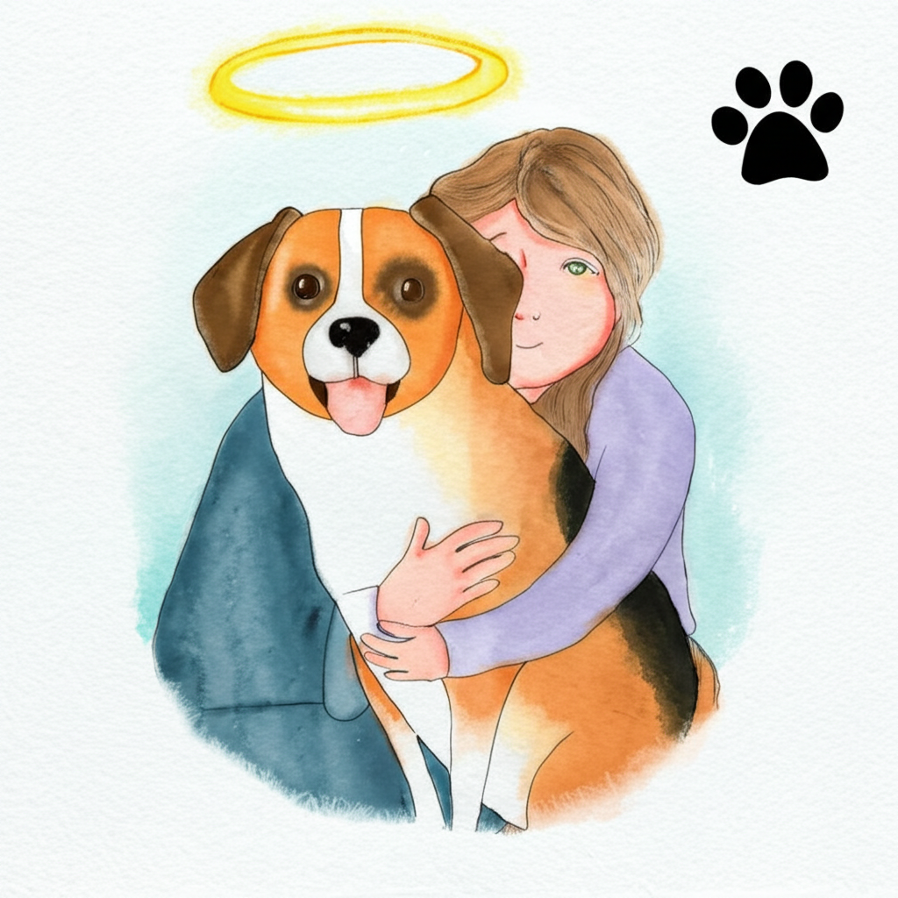

iCendant Speech, The Voice of Emotion, provides a simple API for the generation of emotionally nuanced speech that automatically adjusts pitch, cadence, and volume based on a persona you provide with a choice of over 500 voices.

iCendant Speech uses the same engine as iCendant Empathy to enhance voices by Speechify but is not restricted to generating empathetic audio.

At &dollar;0.008 per 1,000 characters, iCendant Speech is less than half the typical cost of Hume or Eleven Labs, 2x the speed of Hume and comparable to ElevenLabs.

The API supports streaming, awaiting, and polling. Webhook notification is under development.

Preview the API [Playground](https://icendant.com/dashboard).

[Register](https://g6zarn.logto.app/register) (subject to approval) if you would like to participate in our early access program.

### Examples

These Medium articles compare iCendant Speech with other text-to-speech engines on raw input text:

[The Voices of AI: Poetry](https://medium.com/@anywhichway/the-voices-of-ai-poetry-59111475087d)

[The Voices of AI: Meditation](https://medium.com/@anywhichway/the-voices-of-ai-meditation-c3525d9d1632)

[The Voices of AI: Coaching](https://medium.com/@anywhichway/the-voices-of-ai-coaching-09adf71ff7b8)

### Pricing

iCendant Speech operates on a pre-paid credit system, where each credit is worth &dollar;0.001 USD. This means that 1,000 characters cost &dollar;0.008 USD.

Conversational speech will consume 800 to 1,000 characters per minute, so the cost is approximately $0.01 per minute of audio.

Monthly subscriptions are required at either $25 or $50 per month, which include 1,000 or 2,500 credits respectively. These charges include email support.

The subscription credits at about 2.5 hours and 6 hours should be sufficient for development and testing.

Monthly credits expire. Additional credits in increments of 10,000 ($10 USD) can be purchased at any time and do not expire.

There is a 10% bonus of non-expiring credits for every 6 months of subscription.

If you have a $50 subscription for 6 months, you will get a bonus of 5,000 non-expiring credits with no cash refund value.

If you have a $25 subscription for 6 months, you will get a bonus of 2,500 non-expiring credits with no cash refund value.

The order of credit use is susbcription, purchased, bonus.

### More Examples

Below are more examples of the text-to-speech capability of iCendant Speech.

<table>
<tr>
<td>Project Manager's Report</td>
<td>

<audio controls><source src="./assets/audio/project-manager-report.mp3" type="audio/mpeg" />Your browser does not support the audio element.</audio>
</td>
</tr>
<tr>
<td>Friend's Response To Job loss</td>
<td>

<audio controls><source src="./assets/audio/job-loss.mp3" type="audio/mpeg" />Your browser does not support the audio element.</audio>
</td>
</tr>
<tr>
<td>Football Coach Response To Job Loss</td>
<td>

<audio controls><source src="./assets/audio/job-loss-coach-response.mp3" type="audio/mpeg" />Your browser does not support the audio element.</audio>
</td>
</tr>
<tr>
<td>Losing Pet</td>
<td>

<audio controls><source src="./assets/audio/losing-pet.mp3" type="audio/mpeg" />Your browser does not support the audio element.</audio>
</td>
</tr>
<tr>
<td>Dawn Poem</td>
<td>

<audio controls><source src="./assets/audio/dawn-poem.mp3" type="audio/mpeg" />Your browser does not support the audio element.</audio>
</td>
</tr>
<tr>
<td>Hope And Wonder Poem</td>
<td>

<audio controls><source src="./assets/audio/poem.mp3" type="audio/mpeg" />Your browser does not support the audio element.</audio>
</td>
</tr>
<tr>
<td>Loving kindness meditation</td>
<td>

<audio controls><source src="./assets/audio/loving-kindness-meditation.mp3" type="audio/mpeg" />Your browser does not support the audio element.</audio>
</td>
</tr>
<tr>
<td>Family meditation</td>
<td>

<audio controls><source src="./assets/audio/family-meditation-enhanced.mp3" type="audio/mpeg" />Your browser does not support the audio element.</audio>
</td>
</tr>
</table>